# 🧠 Habit Tracker App


A **Command-Line Interface (CLI)** application built and tested with **Python 3.13.7**, designed to help users **create, track, and analyze habits** using a modular, testable architecture.

Developed as part of the **IU course DLBDSOOFPP01 – Object-Oriented and Functional Programming with Python**.

---

## 📘 Overview

The Habit Tracker helps users build consistent daily and weekly routines by tracking habits, marking completions, and analyzing streaks.  
It applies **Object-Oriented Programming (OOP)** for business logic and **Functional Programming (FP)** for analytics — providing a clean, maintainable structure.

---

## 🧩 Features

- ✅ Create, view, edit, and delete habits  
- 🔁 Supports **daily** and **weekly** habits  
- 🗓️ Mark habits as **completed**  
- 📊 Analyze progress and streaks  
- 💾 Persistent data storage via **SQLite**
- 🔐 Secure login with **PBKDF2-HMAC (SHA-256) password hashing with random salt**  
- 🧪 Tested with **pytest**  
- 💬 User-friendly CLI built with **questionary**

---

## 🏗️ Architecture Overview

| Layer | Description | Example Components |
|-------|--------------|--------------------|
| **Boundary (UI)** | Handles user interaction and display | `CLI (questionary)` |
| **Control (Service)** | Core application logic | `HabitManager`, `AuthManager` |
| **Entity (Data)** | Data models (independent of storage) | `Habit`, `User` |
| **Persistence (Storage)** | Saves and loads data | `Storage`, `SQLStore` |
| **Analytics (Functional)** | Pure functions (no side effects) | `analytics.py` |

### Design Principles
- Clear **separation of concerns**
- **Swappable** UI and storage backends
- Analytics layer is **pure and side-effect free**
- Testable modular design (OOP + FP blend)

---

## 📂 Project Structure

The repository follows a **modular `src` layout**, separating domain models, application services, analytics logic, and persistence to keep the system maintainable and testable.

```text
habit-tracker/
│
├── src/habit_tracker/      # Main application package
│   ├── analytics/          # Functional analytics for streak calculations and habit analysis
│   ├── fixtures/           # Predefined habits and example tracking data used for demos and testing
│   ├── models/             # Core domain models (Habit, User)
│   ├── services/           # Application logic and coordination (HabitManager, AuthManager)
│   ├── storage/            # Persistence layer and database interaction (SQLite backend)
│   └── ui/                 # Command-line interface and user interaction
│
├── tests/                  # Unit tests 
├── docs/                   # Project documentation, diagrams, and screenshots
├── data/                   # Application data storage
│
├── pyproject.toml          # Project configuration and build metadata
├── requirements-dev.txt    # Development and testing dependencies
├── pytest.ini              # Pytest configuration
├── README.md               # Project documentation and usage instructions
└── LICENSE                 # MIT license
```

---

## ⚙️ Installation (Step-by-Step)

### 1️⃣ Clone the repository
```bash
git clone https://github.com/n1wo/habit-tracker.git
```
```bash
cd habit-tracker
```

### 2️⃣ Create and activate a virtual environment
**Windows (PowerShell):**

```powershell
python -m venv .venv
```
```powershell
.venv\Scripts\activate
```

**macOS/Linux:**
```bash
python -m venv .venv
```
```bash
source .venv/bin/activate
```

### 3️⃣ Install the project (runtime dependencies)
Install the project in editable mode so Python automatically finds the src/ layout:
```bash
pip install -e .
```

(Optional) Install development & test dependencies
```bash
pip install -r requirements-dev.txt
```

---

## 🚀 Usage

### Run the app
From the project root:
```bash
python -m habit_tracker
```

### The CLI will guide you through:
- 🔐 First-time password setup (stored securely)
- 📋 Main menu for creating, viewing, editing, and analyzing habits
- ✅ Marking habits as completed
- 🏆 Viewing streak analytics

#### Example flow:
1. Startup
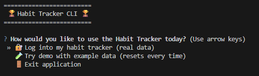
2. Password Setup
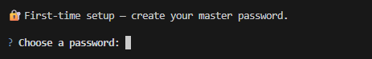
3. Main Menu
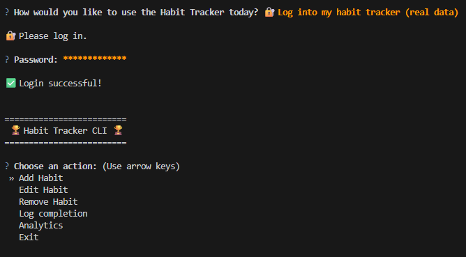
4. Add Habit
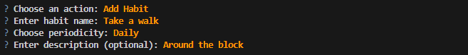
5. Habit list
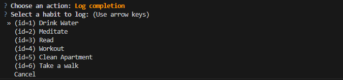
6. Log Completion
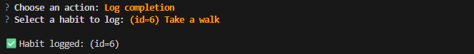
7. Analytics Menu
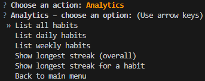
8. Habit Inspection
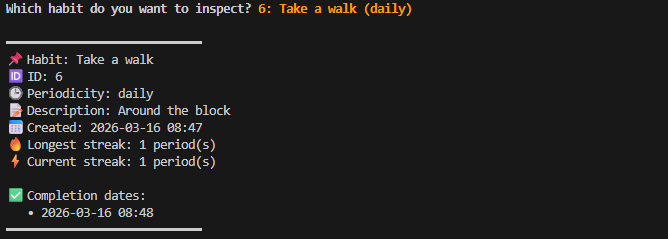

---

## 🧪 Running Tests

Run all unit tests with:
```bash
pytest
```

### Test coverage includes:
- Habit creation, editing, and deletion
- Completion tracking and streak logic
- Analytics (pure functions)
- Authentication and password handling

---

## 📁 Example Data

The example dataset includes:
- 5 sample habits (daily and weekly)
- 4 weeks of completions (demo)
Use it to test analytics and habit streak features.

---

## 📋 Requirements Summary

- **Python ≥ 3.10** (developed/tested with Python 3.13.7) 
- No external habit-tracking libraries  
- Project must include:
  - README with setup and usage instructions  
  - Docstrings and comments  
  - Persistent storage (SQLite)  
  - Functional analytics  
  - Unit tests (`pytest`)

---

## 💡 Notes for Developers

- Use `HabitService` (abstract base class) to define the logic interface.  
- `HabitManager` implements this interface and is injected into the CLI.  
- Run the app with:
  ```bash
  python -m habit_tracker
  ```
- If you use the `src/` layout, either:
  - Run via `pip install -e .`, or  
  - Temporarily set the path:
    ```powershell
    $env:PYTHONPATH = (Resolve-Path "src").Path
    ```

## 🗄️ Documentation

Additional project documentation is available in the `docs/` folder.

These include:
- project concept
- architecture diagram
- development presentation
- screenshots of the CLI application
- abstract draft

## 📷 Screenshots

### Login / Mode Selection
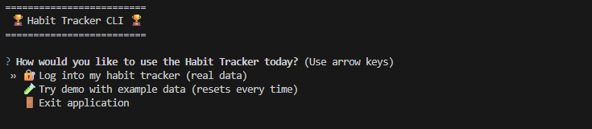

### Main Menu
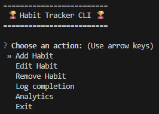

### Stored User Record
Stored credentials are saved as a password hash and random salt, not as plaintext passwords.

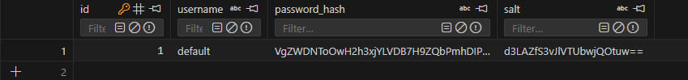

### Test Suite
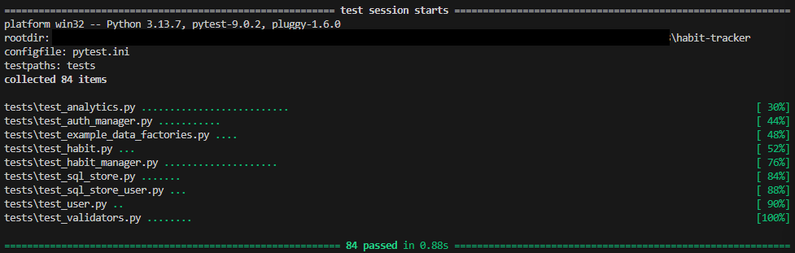

### Habit Inspection
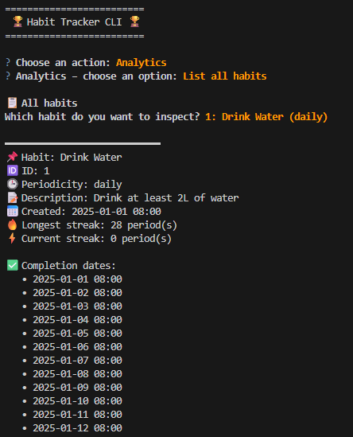